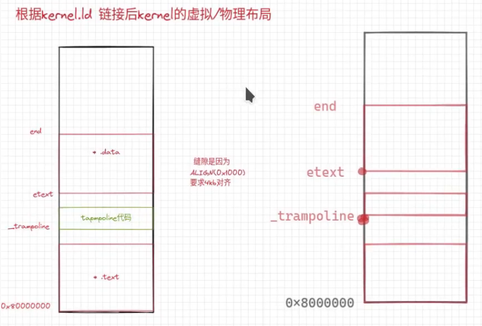

## Makefile解读
[B站解读xv6 MakeFile](https://www.bilibili.com/video/BV1nr4y167S9/?spm_id_from=..search-card.all.click&vd_source=d0cbe5b05dc1cba268f43f8b95f9361d)

```makefile
饺子: 饺子皮 肉馅
  用饺子皮包裹肉馅

饺子皮: 面粉 水
  和面
  擀面

肉馅: 五花肉 白菜 调味料
  剁碎
  调味

五花肉: 
  买
白菜:
  买
调味料:
  买
```

### `make qemu`
```makefile
qemu: $K/kernel fs.img
	$(QEMU) $(QEMUOPTS)

QEMU = qemu-system-riscv64
```
\$K就是makefile中的变量，比如K=kernel，使用的时候就会原封不动地替换过去。kernel编译后就是操作系统本身，fs.img就是文件系统镜像，相当于一块硬盘(存放用户程序)。 QEMU是用来模拟risc-v的一个CPU.

### 编译kernel生成可执行文件
```makefile
$K/kernel: $(OBJS) $K/kernel.ld $U/initcode
	$(LD) $(LDFLAGS) -T $K/kernel.ld -o $K/kernel $(OBJS) 
	$(OBJDUMP) -S $K/kernel > $K/kernel.asm
	$(OBJDUMP) -t $K/kernel | sed '1,/SYMBOL TABLE/d; s/ .* / /; /^$$/d' > $K/kernel.sym
```
\$K/kernel.ld是一个负责链接的脚本。它指导将\$(OBJS)对象文件(可重定向文件)链接为我们要的kernel文件。它还依赖于第一个用户程序\$U/initcode

### 链接器脚本kernel.ld如何指导链接
```C
OUTPUT_ARCH( "riscv" )
ENTRY( _entry ) /* 可执行目标文件入口 */

SECTIONS
{
  /*
   * ensure that entry.S / _entry is at 0x80000000,
   * where qemu's -kernel jumps.
   */
  . = 0x80000000; /*虚拟地址，当前地址设为0x80000000 */
 
  .text : {
    *(.text .text.*)    /* 把.o文件的所有text节拿出来，组成一个全新的text节 */
    . = ALIGN(0x1000);  /* .代表当前位置，现在做个4kb页对齐 */
    _trampoline = .;
    *(trampsec)         /* 与中断相关的一段代码，不超过一个页大小，否则报error */
    . = ALIGN(0x1000);
    ASSERT(. - _trampoline == 0x1000, "error: trampoline larger than one page");
    PROVIDE(etext = .); /* 当前位置etext = 0x80000000 + 0x1000 + 0x1000，这个变量C语言中可以引用 */
  }

  .rodata : {
    . = ALIGN(16);
    *(.srodata .srodata.*) /* do not need to distinguish this from .rodata */
    . = ALIGN(16);
    *(.rodata .rodata.*)
  }

  .data : {
    . = ALIGN(16);
    *(.sdata .sdata.*) /* do not need to distinguish this from .data */
    . = ALIGN(16);
    *(.data .data.*)
  }

  .bss : {
    . = ALIGN(16);
    *(.sbss .sbss.*) /* do not need to distinguish this from .bss */
    . = ALIGN(16);
    *(.bss .bss.*)
  }

  PROVIDE(end = .);  /* 用变量end记录位置 */
}
```
可重定位目标文件内部是分为很多节的：
- text: 存放程序文本
- rodata: 存放只读数据
- data: 存放可读可写数据
- bss: 未初始化的全局变量(静态内存分配)

xv6直接把这段地址作了直接地址映射，所以上面的虚拟地址也是实际物理地址。



### 第一个用户程序initcode
```C
// proc.c
// 这个程序由initcode.S而来，嵌入了.c程序之中
// a user program that calls exec("/init")
// od -t xC initcode
uchar initcode[] = {
  0x17, 0x05, 0x00, 0x00, 0x13, 0x05, 0x45, 0x02,
  0x97, 0x05, 0x00, 0x00, 0x93, 0x85, 0x35, 0x02,
  0x93, 0x08, 0x70, 0x00, 0x73, 0x00, 0x00, 0x00,
  0x93, 0x08, 0x20, 0x00, 0x73, 0x00, 0x00, 0x00,
  0xef, 0xf0, 0x9f, 0xff, 0x2f, 0x69, 0x6e, 0x69,
  0x74, 0x00, 0x00, 0x24, 0x00, 0x00, 0x00, 0x00,
  0x00, 0x00, 0x00, 0x00
};
```

```s
# Initial process that execs /init.
# This code runs in user space.

#include "syscall.h"

# exec(init, argv)
.globl start
start:
        la a0, init     # 程序名称
        la a1, argv     # 参数
        li a7, SYS_exec # 系统调用exec
        ecall

# for(;;) exit();
exit:
        li a7, SYS_exit
        ecall
        jal exit

# char init[] = "/init\0";
init:
  .string "/init\0"

# char *argv[] = { init, 0 };
.p2align 2
argv:
  .long init
  .long 0

```

### kernel编译流程
1. 编译./kernel目录下的.c和.S的源代码，编译完得到.o目标文件
2. 按照kernel.ld脚本内的指令将这一堆.o文件链接起来，得到最终的内核可执行文件kernel
3. 按照kernel.ld脚本，可执行文件入口被指定为_entry，该符号被定义在./kernel/entry.S中

## 文件镜像fs.img
```makefile
fs.img: mkfs/mkfs README $(UEXTRA) $(UPROGS)
	mkfs/mkfs fs.img README $(UEXTRA) $(UPROGS)
```
`mkfs`将`README`和`$(UEXTRA) $(UPROGS)`写入到文件镜像中