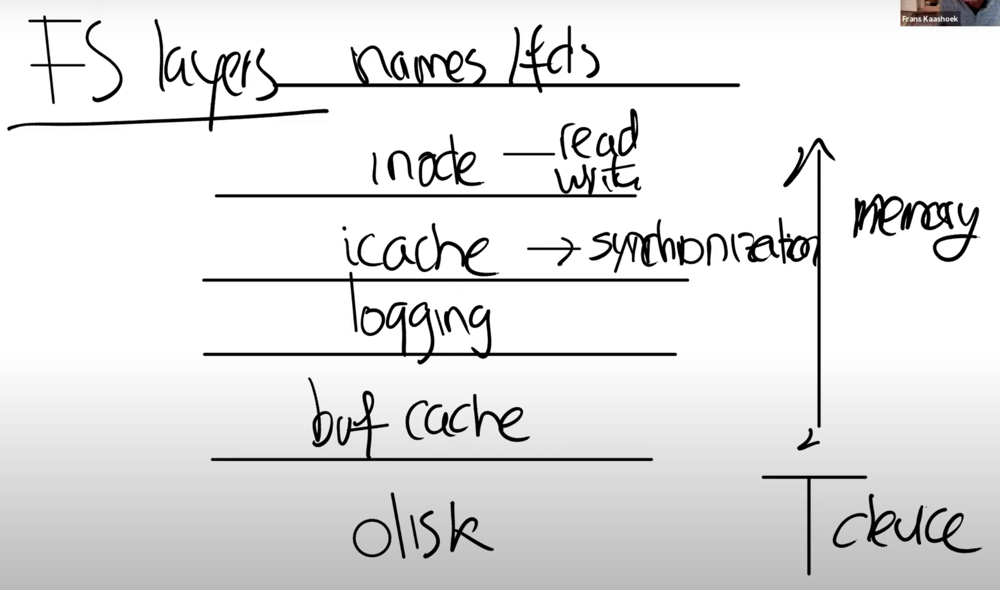
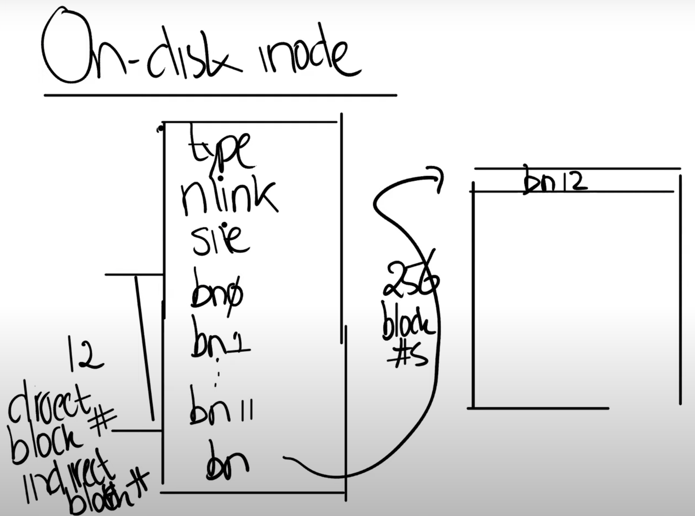
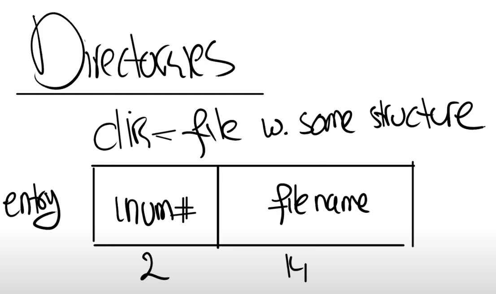

## 文件系统特性
- 用户友好的文件名，具体来说就是层级的路径名，这可以帮助用户组织目录中的文件(User friendly names / pathnames)
- 通过将文件命名成方便易记的名字，可以在用户之间和进程之间更简单的共享文件(Share files between users / processes)
- 相比我们已经看过的xv6其他子系统，这一点或许是最重要的，文件系统提供了持久化。这意味着，我可以关闭一个计算机，过几天再开机而文件仍然在那，我可以继续基于文件工作。这一点与进程和其他资源不一样，这些资源在计算机重启时就会消失，之后你需要重新启动它们，但是文件系统就可以提供持久化(Persistence / Durability / Crash safety)

## 文件系统要提供的能力
- 命名甚至是为一个文件多个命名
- 需要以某种方式跟踪指向同一个文件的多个文件名

最重要的可能就是inode，这是代表一个文件的对象，并且它不依赖于文件名。实际上，inode是通过自身的编号来进行区分的，这里的编号就是个整数。所以文件系统内部通过一个数字，而不是通过文件路径名引用inode。同时，基于之前的讨论，inode必须有一个link count来跟踪指向这个inode的文件名的数量。一个文件（inode）只能在link count为0的时候被删除。实际的过程可能会更加复杂，实际中还有一个openfd count，也就是当前打开了文件的文件描述符计数。一个文件只能在这两个计数器都为0的时候才能被删除。

文件描述符必然自己悄悄维护了对于文件的offset

文件系统的结构：
- 在最底层是磁盘，也就是一些实际保存数据的存储设备，正是这些设备提供了持久化存储。
- 在这之上是buffer cache或者说block cache，这些cache可以避免频繁的读写磁盘。这里我们将磁盘中的数据保存在了内存中。
- 为了保证持久性，再往上通常会有一个logging层。许多文件系统都有某种形式的logging，我们下节课会讨论这部分内容，所以今天我就跳过它的介绍。
- 在logging层之上，XV6有inode cache，这主要是为了同步（synchronization），我们稍后会介绍。inode通常小于一个disk block，所以多个inode通常会打包存储在一个disk block中。为了向单个inode提供同步操作，XV6维护了inode cache。
- inode本身。它实现了read/write。
- 文件名，和文件描述符操作。

## How fs uses disk
从文件系统的角度来看磁盘还是很直观的。因为对于磁盘就是读写block(1024Bytes)或者sector(512Bytes)，我们可以将磁盘看作是一个巨大的block的数组，数组从0开始，一直增长到磁盘的最后。

- block0要么没有用，要么被用作boot sector来启动操作系统(包含启动代码)。
- block1通常被称为super block，它描述了文件系统。它可能包含磁盘上有多少个block共同构成了文件系统这样的信息。我们之后会看到XV6在里面会存更多的信息，你可以通过block1构造出大部分的文件系统信息。
在XV6中，log从block2开始，到block32结束。实际上log的大小可能不同，这里在super block中会定义log就是30个block。
- 接下来在block32到block45之间，XV6存储了inode。我之前说过多个inode会打包存在一个block中，一个inode是**64Bytes**。
- 之后是bitmap block，这是我们构建文件系统的默认方法，它只占据一个block。它记录了数据block是否空闲。
- 之后就全是数据block了，数据block存储了文件的内容和目录的内容。

## inode
- 通常来说它有一个type字段，表明inode是文件还是目录。
- nlink字段，也就是link计数器，用来跟踪究竟有多少文件名指向了当前的inode。
- size字段，表明了文件数据有多少个字节。
- 不同文件系统中的表达方式可能不一样，不过在XV6中接下来是一些block的编号，例如编号0，编号1，等等。XV6的inode中总共有12个block编号。这些被称为direct block number。这12个block编号指向了构成文件的前12个block。举个例子，如果文件只有2个字节，那么只会有一个block编号0，它包含的数字是磁盘上文件前2个字节的block的位置。
- 之后还有一个indirect block number，它对应了磁盘上一个block，这个block包含了256个block number，这256个block number包含了文件的数据。所以inode中block number 0到block number 11都是direct block number，而block number 12保存的indirect block number指向了另一个block。

所以xv6最大长度是268 * 1024 bytes.

接下来，我们想要实现read系统调用。假设我们需要读取文件的第8000个字节，那么你该读取哪个block呢？从inode的数据结构中该如何计算呢？

对于8000，我们首先除以1024，也就是block的大小，得到大概是7。这意味着第7个block就包含了第8000个字节。所以直接在inode的direct block number中，就包含了第8000个字节的block。为了找到这个字节在第7个block的哪个位置，我们需要用8000对1024求余数，我猜结果是是832。所以为了读取文件的第8000个字节，文件系统查看inode，先用8000除以1024得到block number，然后再用8000对1024求余读取block中对应的字节。

### directory 目录项
文件系统的酷炫特性就是层次化的命名空间（hierarchical namespace），你可以在文件系统中保存对用户友好的文件名。大部分Unix文件系统有趣的点在于，一个目录本质上是一个文件加上一些文件系统能够理解的结构。在XV6中，这里的结构极其简单。每一个目录包含了directory entries，每一条entry都有固定的格式：
- 前2个字节包含了目录中文件或者子目录的inode编号，
- 接下来的14个字节包含了文件或者子目录名。

所以每个目录项共有16字节。

inode中的type字段表明这是一个目录还是一个文件。如果你对一个类型是文件的inode进行查找，文件系统会返回错误。

对于实现路径名查找，这里的信息就足够了。假设我们要查找路径名“/y/x”，我们该怎么做呢？

从路径名我们知道，应该从root inode开始查找。通常root inode会有固定的inode编号，在XV6中，这个编号是1。我们该如何根据编号找到root inode呢？从前一节我们可以知道，inode从block 32开始，如果是inode1，那么必然在block 32中的64到128字节的位置(一个inode 64bytes)。所以文件系统可以直接读到root inode的内容。

对于路径名查找程序，接下来就是扫描root inode包含的所有block，以找到“y”。该怎么找到root inode所有对应的block呢？根据前一节的内容就是读取所有的direct block number和indirect block number。

结果可能是找到了，也可能是没有找到。如果找到了，那么目录y也会有一个inode编号，假设是251，我们可以继续从inode 251查找，先读取inode 251的内容，之后再扫描inode所有对应的block，找到“x”并得到文件x对应的inode编号，最后将其作为路径名查找的结果返回。

我们可以继续从inode 251查找，先读取inode 251的内容，之后再扫描inode所有对应的block，找到“x”并得到文件x对应的inode编号，最后将其作为路径名查找的结果返回。

## hard-link和soft-link的区别
Hard-link:
- 具有**相同inode节点号**的多个文件互为硬链接文件；
- 删除硬链接文件或者删除源文件任意之一，文件实体并未被删除；
- 只有删除了源文件和所有对应的硬链接文件，文件实体才会被删除；
- 硬链接文件是文件的另一个入口；
- 可以通过给文件设置硬链接文件来防止重要文件被误删；
- 创建硬链接命令 ln 源文件 硬链接文件；
- 硬链接文件是普通文件，可以用rm删除；
- 对于静态文件（没有进程正在调用），当硬链接数为0时文件就被删除。注意：如果有进程正在调用，则无法删除或者即使文件名被删除但空间不会释放。

Soft-link:
- 软链接类似windows系统的**快捷方式**；
- 软链接里面存放的是源文件的**路径**，指向源文件；
- 删除源文件，软链接依然存在，但无法访问源文件内容；
- 软链接失效时一般是白字红底闪烁；
- 创建软链接命令 ln -s 源文件 软链接文件；
- 软链接和源文件是不同的文件，文件类型也不同，inode号也不同；
- 软链接的文件类型是“l”，可以用rm删除。

Diff:
原理上，硬链接和源文件的inode节点号相同，两者互为硬链接。软连接和源文件的inode节点号不同，进而指向的block也不同，软连接block中存放了源文件的路径名。 实际上，硬链接和源文件是同一份文件，而软连接是独立的文件，类似于快捷方式，存储着源文件的位置信息便于指向。 使用限制上，不能对目录创建硬链接，不能对不同文件系统创建硬链接，不能对不存在的文件创建硬链接；可以对目录创建软连接，可以跨文件系统创建软连接，可以对不存在的文件创建软连接。

所以硬链接放在哪里？