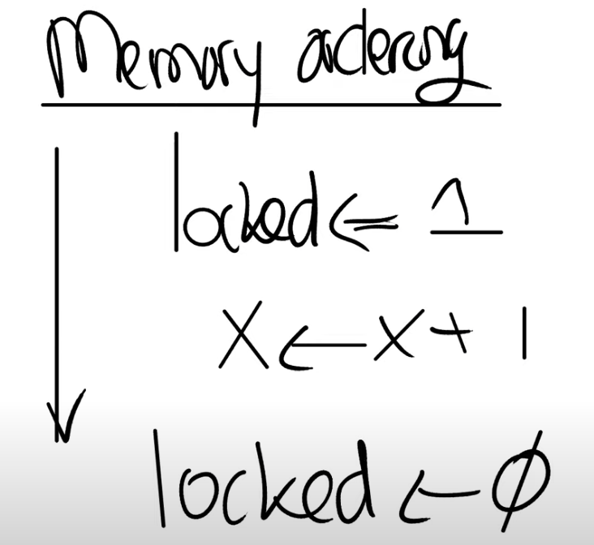
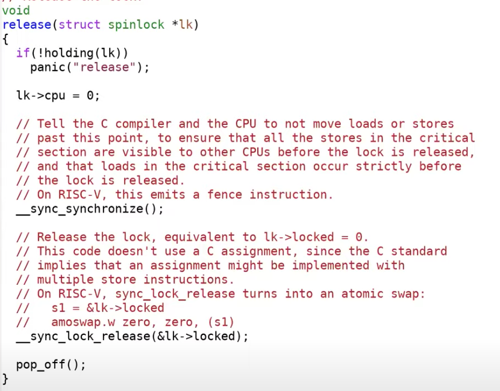
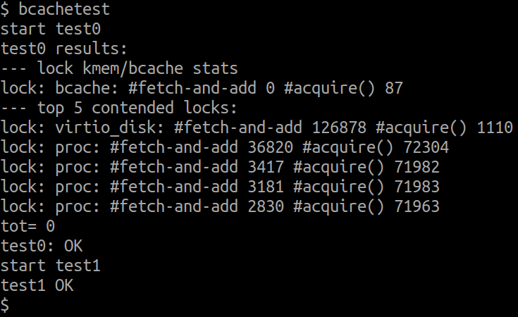

## Why locks?
如果一个应用程序想要提升性能，它不能只依赖单核，必须要依赖于多核。这也意味着，如果应用程序与内核交互的较为紧密，那么操作系统也需要高效的在多个CPU核上运行。这就是我们对内核并行的运行在多个CPU核上感兴趣的直接原因。

那为什么要使用锁呢？前面我们已经提到了，是为了确保正确性。当一份共享数据同时被读写时，如果没有锁的话，可能会出现race condition，进而导致程序出错。race condition是比较讨厌的，我们先来看看什么是race condition。

xv6最简单的例子是，两个CPU同一时间调用了`kfree`释放页，没锁的话，页可能就不会回收到空闲链表上了。

锁的作用：
1. 锁可以避免丢失更新。如果你回想我们之前在kalloc.c中的例子，丢失更新是指我们丢失了对于某个内存page在kfree函数中的更新。如果没有锁，在出现race condition的时候，内存page不会被加到freelist中。但是加上锁之后，我们就不会丢失这里的更新。
2. 锁可以打包多个操作，使它们具有原子性。我们之前介绍了加锁解锁之间的区域是critical section，在critical section的所有操作会都会作为一个原子操作执行。
3. 锁可以维护共享数据结构的不变性。共享数据结构如果不被任何进程修改的话是会保持不变的。如果某个进程acquire了锁并且做了一些更新操作，共享数据的不变性暂时会被破坏，但是在release锁之后，数据的不变性又恢复了。你们可以回想一下之前在kfree函数中的freelist数据，所有的free page都在一个单链表上。但是在kfree函数中，这个单链表的head节点会更新。freelist并不太复杂，对于一些更复杂的数据结构可能会更好的帮助你理解锁的作用。

## 自旋锁实现：
依靠risc-v的原子指令`amoswap`(atomic memory swap). 这个特殊的硬件指令会保证一次test-and-set操作的原子性。这个指令接收3个参数，分别是address，寄存器r1，寄存器r2。这条指令会先锁定住address，将address中的数据保存在一个临时变量中（tmp），之后将r1中的数据写入到地址中，之后再将保存在临时变量中的数据写入到r2中，最后再对于地址解锁。
```S
amoswap addr, r1, r2

- lock addr
- tmp <- *addr
- *addr <- r1
- r2 <- tmp
- unlock addr
```
(其实就是完成了四个步骤：对于地址加锁，读出数据，写入新数据，然后再返回旧数据)
这里我们通过将一个软件锁转变为**硬件锁**最终实现了原子性。不同处理器的具体实现可能会非常不一样，处理器的指令集通常像是一个说明文档，它不会有具体实现的细节，具体的实现依赖于内存系统是如何工作的。

spinlock需要处理两类并发，一类是不同CPU之间的并发，一类是相同CPU上中断和普通程序之间的并发。针对后一种情况，我们需要在acquire中关闭中断。中断会在release的结束位置再次打开，因为在这个位置才能再次安全的接收中断。

为什么不用load/store实现？他们很可能不是原子指令：可能去读了cache，或者流水线优化指令了。



另外，编译器或者处理器可能会重排指令以获得更好的性能。对于上面的串行指令流，如果将x<-x+1移到locked<-0之后可以吗？这会改变指令流的正确性吗？

并不会，因为x和锁完全相互独立，它们之间没有任何关联。如果他们还是按照串行的方式执行，x<-x+1移到锁之外也没有问题。所以在一个串行执行的场景下是没有问题的。实际中，处理器在执行指令时，实际指令的执行顺序可能会改变。编译器也会做类似的事情，编译器可能会在不改变执行结果的前提下，优化掉一些代码路径并进而改变指令的顺序。
但是对于并发执行，很明显这将会是一个灾难。如果我们将critical section与加锁解锁放在不同的CPU执行，将会得到完全错误的结果。所以指令重新排序在并发场景是错误的。为了禁止，或者说为了告诉编译器和硬件不要这样做，我们需要使用memory fence或者叫做synchronize指令，来确定指令的移动范围。对于synchronize指令，任何在它之前的load/store指令，都不能移动到它之后。锁的acquire和release函数都包含了synchronize指令。



xv6自旋锁实现：
```C
// Mutual exclusion lock.
struct spinlock {
  uint locked;       // Is the lock held?

  // For debugging:
  char *name;        // Name of lock.
  struct cpu *cpu;   // The cpu holding the lock.
};

// Acquire the lock.
// Loops (spins) until the lock is acquired.
void
acquire(struct spinlock *lk)
{
  push_off(); // disable interrupts to avoid deadlock.
  if(holding(lk)){
    printf("lk->name: %s\n", lk->name);
    panic("acquire");
  }   

  // On RISC-V, sync_lock_test_and_set turns into an atomic swap:
  //   a5 = 1
  //   s1 = &lk->locked
  //   amoswap.w.aq a5, a5, (s1)
  while(__sync_lock_test_and_set(&lk->locked, 1) != 0) {

  }

  // Tell the C compiler and the processor to not move loads or stores
  // past this point, to ensure that the critical section's memory
  // references happen strictly after the lock is acquired.
  // On RISC-V, this emits a fence instruction.
  __sync_synchronize();

  // Record info about lock acquisition for holding() and debugging.
  lk->cpu = mycpu();
}

// Release the lock.
void
release(struct spinlock *lk)
{
  if(!holding(lk)){
    printf("lk->name: %s\n", lk->name);
    panic("release");
  }

  lk->cpu = 0;

  // Tell the C compiler and the CPU to not move loads or stores
  // past this point, to ensure that all the stores in the critical
  // section are visible to other CPUs before the lock is released,
  // and that loads in the critical section occur strictly before
  // the lock is released.
  // On RISC-V, this emits a fence instruction.
  __sync_synchronize();

  // Release the lock, equivalent to lk->locked = 0.
  // This code doesn't use a C assignment, since the C standard
  // implies that an assignment might be implemented with
  // multiple store instructions.
  // On RISC-V, sync_lock_release turns into an atomic swap:
  //   s1 = &lk->locked
  //   amoswap.w zero, zero, (s1)
  __sync_lock_release(&lk->locked);

  pop_off();
}

```

当加锁失败时，互斥锁用「线程切换」来应对，自旋锁则用「忙等待」来应对。

## LAB

### Memory allocator
为每个CPU核都分配一个空闲链表管理空闲页，如果当前CPU的链表为空，则向其他CPU那里的链表偷一个过来就行了。

### Buffer cache
原本的buffer cache是一个LRU单链表的结构，`bcache.head.next`是最近访问的，而`bcache.head.prev`则是最久之前访问的。只有当`b->refcnt==0`的时候(`brelease`)，才会把它置为`bcache.head.next`，因为我们要分配新的block cache的时候会从前往后遍历，这样就能按照release的顺序找到LRU的block了。如果用完buffer就会panic了。

每次我们要访问或者更改`bcache`，都要上一把大锁，这样锁争用的情况会很严重。实验要求我们修改`bget`和`brelse`使得并发的查找和释放不同的blocks尽少出现争用情况。另外你要修改`bpin`和`bunpin`，你不改也能过，实测`bcache.lock`的`#acquire()`会处在200～300范围之内。一并修改`bpin`和`bunpin`改为哈希表的锁，会下降到80左右。

注意，被pin住的页我们是不能替换的，只能选择最远未使用的页进行替换。

我们选择13作为`hashtbl`桶的数量，每个桶维护一个链表。一开始`hashtbl`是空的。由于使用多个桶，当buf的`refcnt == 0`时，我们要额外为这些buf维护时间，以便evict阶段遍历buf数组找到LRU的buf，还要维护这个buf是否被加入到`hashtbl`之中.

实验要求给了个提示：
```
It is OK to serialize eviction in bget (i.e., the part of bget that selects a buffer to re-use when a lookup misses in the cache).
```
Evict解决你可以上一把大锁。你一开始可能是这么想的：
1. 根据blockno求桶的hashid，加哈希表的桶锁，遍历该桶，如果cached了，修改refcnt、解锁、返回
2. 没有cached，加上bcache.lock，在加上该加的桶锁，遍历buf数组寻找LRU的block，替换掉，解锁，返回

就像这样：
```C
static struct buf*
bget(uint dev, uint blockno)
{
  // acquire bucket lock
  for {
    // ... see if such block is cached
  }

  // acquire bcache.lock
  for {
    // ... eviction
  }
  // release bucket lock
  // release eviction
}
```

然而在第二步会造成相当多的问题：
1. 在bcache.lock上锁和桶lock上锁之间，block可能已经被别的CPU核cache进buf了
2. 在bcache.lock上锁前，你**没有**释放掉第一步获取的桶锁，考虑这么一种死锁情况
```C
Thread1                   Thread2
// Check bucket
acquire(hashtbl.lock[1])  
                          // Check bucket
                          acquire(hashtbl.lock[2])
// Begin eviction
acquire(bcache.lock)
                          // Begin eviction
                          acquire(bcache.lock)
acquire(hashtbl.lock[2])
```
第一个问题的解决方案是，你在Evict的开始，对桶上锁，再次检查该桶是否存在对应的block。如果没有就继续持有锁，完成buf移动再释放。

第二个问题的解决方案是，你在`bget`开头检查是否有cache后就应该立刻释放掉桶锁，在evict阶段重新上锁，像这样
```C
// ... see if it is cached
// Must release, otherwise deadlock arises
release(&hashtbl.lock[hashid]);  

// Not cached. Eviction can be serialize
acquire(&bcache.lock);
acquire(&hashtbl.lock[hashid]);
// Recycle the least recently used (LRU) unused buffer.
```
这样就能从第一步结束的时候打破死锁了。

另外要注意的是，evict阶段检查buf的时候，最多会获取三个桶锁，最少一个，边界情况要仔细处理，避免死锁。

```C
struct buf {
  // ...
  uint time; // LRU needed
  int vis;   
};

void
binit(void)
{
  struct buf *b;

  initlock(&bcache.lock, "bcache");

  // Initialize buffers
  int i = 0;
  for(b = bcache.buf; b < bcache.buf + NBUF; b++, i++){
    initsleeplock(&b->lock, "BufferLock");
    b->vis = 0;
    b->time = ticks;
    b->prev = b->next = NULL;
  }
  
  // Initialize hashtbl's locks
  for(i = 0; i < NHASH; ++i){
    initlock(&hashtbl.lock[i], "HashtblLock");  // normal lock
    hashtbl.bucket[i] = NULL;
  }
}

static struct buf*
bget(uint dev, uint blockno)
{
  struct buf *b;

  // Is the block already cached?
  int hashid = blockno % NHASH;
  acquire(&hashtbl.lock[hashid]);
  for(b = hashtbl.bucket[hashid]; b != NULL; b = b->next){
    if(b->dev == dev && b->blockno == blockno){
      b->refcnt++;
      release(&hashtbl.lock[hashid]);

      acquiresleep(&b->lock);
      return b;
    }
  }

  // Must release, otherwise deadlock arises
  release(&hashtbl.lock[hashid]);  

  // Not cached. Eviction can be serialize
  acquire(&bcache.lock);
  acquire(&hashtbl.lock[hashid]);
  // Recycle the least recently used (LRU) unused buffer.
  for(b = hashtbl.bucket[hashid]; b != NULL; b = b->next){
    if(b->dev == dev && b->blockno == blockno){
      b->refcnt++;
      release(&hashtbl.lock[hashid]);

      release(&bcache.lock);   
      acquiresleep(&b->lock);
      return b;
    }
  }

  uint tmin = 0xffffffff;
  struct buf *tminb = NULL;
  int pre_hashid, last_lockid = -1;
  // last_lockid表示找到的目前遍历到的LRU的block的桶编号
  // pre_hashid表示当前遍历到的block的桶编号
  // 这里有点像crab latching，如果遍历到了更LRU的block，需要判断到底要不要上锁解锁
  // 这里最多会涉及到hashtbl的三把锁，特殊情况会比较多，谨慎处理
  for(b = bcache.buf; b < bcache.buf + NBUF; b++){
    // find refcnt == 0 && (LRU), time should be minimum
    pre_hashid = b->blockno % NHASH;
    if(pre_hashid != last_lockid && pre_hashid != hashid){
      acquire(&hashtbl.lock[pre_hashid]);
    }

    if(b->refcnt == 0 && b->time < tmin){
      tminb = b;
      tmin = b->time;

      if(last_lockid != -1 && last_lockid != pre_hashid && last_lockid != hashid) 
        release(&hashtbl.lock[last_lockid]);

      last_lockid = pre_hashid;
      continue;
    }
    if(pre_hashid != last_lockid && pre_hashid != hashid)
      release(&hashtbl.lock[pre_hashid]);
  }
  
  b = tminb;
  if(b && b < bcache.buf + NBUF){
    // Evict. Need to delete pointer in the previous bucket
    if(b->vis){
      if(b->prev) b->prev->next = b->next;
      if(b->next) b->next->prev = b->prev;

      // special case: first element
      if(!b->prev)  hashtbl.bucket[last_lockid] = b->next;
    } else {
      // a block hasn't been in the bucket before
      b->vis = 1;
    }

    b->dev = dev;
    b->blockno = blockno;
    b->valid = 0;
    b->refcnt = 1;

    // push front
    b->prev = NULL;
    b->next = hashtbl.bucket[hashid];
    if(hashtbl.bucket[hashid])
      hashtbl.bucket[hashid]->prev = b;
    hashtbl.bucket[hashid] = b;

    if(hashid != last_lockid) release(&hashtbl.lock[last_lockid]);
    release(&hashtbl.lock[hashid]);

    release(&bcache.lock);    
    acquiresleep(&b->lock);
    return b;
  }

  panic("bget: no buffers");
}

void
brelse(struct buf *b)
{
  if(!holdingsleep(&b->lock))
    panic("brelse");

  releasesleep(&b->lock);

  // compute hash id before lock. Will it be a problem?
  int hashid = b->blockno % NHASH;    
  acquire(&hashtbl.lock[hashid]);

  b->refcnt--;

  if(b->refcnt == 0){
    b->time = ticks;
  }
  
  release(&hashtbl.lock[hashid]);
}

void
bpin(struct buf *b) {
  int hashid = b->blockno % NHASH;
  acquire(&hashtbl.lock[hashid]);
  b->refcnt++;
  release(&hashtbl.lock[hashid]);
}

void
bunpin(struct buf *b) {
  int hashid = b->blockno % NHASH;
  acquire(&hashtbl.lock[hashid]);
  b->refcnt--;
  release(&hashtbl.lock[hashid]);
}
```


`usertests`也没啥问题。