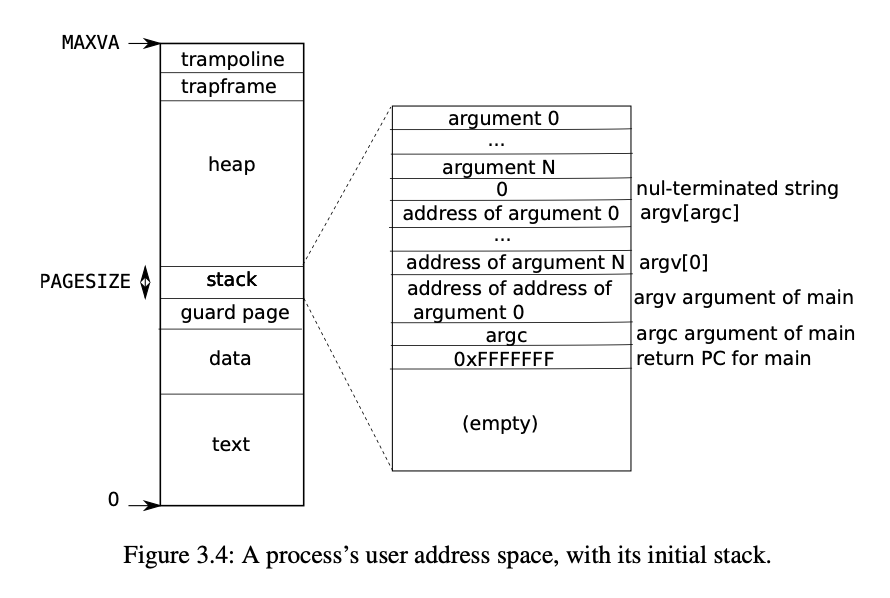

## Lab mmap

`mmap`和相当于把文件内容映射成进程地址空间的内存页，当访问的对应的内存页的时候，触发缺页中断(user-level page fault schemes)，然后由操作系统走文件系统驱动去读取文件。这个过程中，操作系统和文件系统都全程参与了。多个进程可以共享其内存。
```C
// return the map file mem addr
void *mmap(void *addr, size_t length, int prot, int flags,
           int fd, off_t offset);
```
- `addr`: 指示要映射到的地址，lab简化为0，让操作系统决定。
- `length`: 要映射的字节数
- `prot`: 指示内存要映射为可读的、可写的、可执行的，lab假定`PROT_READ`或`PROT_WRITE`或者两者都有
- `flags`: `MAP_SHARED`映射的内存发生修改要写回硬盘；`MAP_PRIVATE`不用写回
- `offset`: lab假定为0

It's OK if processes that map the same MAP_SHARED file do not share physical pages.

```C
munmap(addr, length)
```
去除指定地址范围的`mmap`映射，可能只去除部分，lab保证要么从头开始或者结尾或者整个文件。lab保证不会被切成两片。

### 实验要求
- `mmap`应该实现懒分配，所以它不应该分配物理内存或者读文件，发生缺页中断的时候再处理。保证大文件处理速度以及文件大于物理内存的情况。
- 进程要维护`mmap`作了哪些映射。用个VMA(virtual memory area)存储相关信息，地址、长度、权限、文件(一个指针指向文件)
- 实现`mmap`: 在进程的地址空间找一片区域来映射文件。注意要增加文件的引用次数，免得文件关了VMA就消失了
- 处理缺页中断，读4K内容进页，并做好用户地址空间的映射。`readi`读文件，take an offset
- 实现`munmap`: 找到VMA里的地址范围，unmap掉特定的页(用`uvmunmap`); 如果`munmap`去掉了之前`mmap`的所有页，减掉文件引用次数。
- `exit`需要unmap进程里面`mmap`的页
- `fork`需要保证子进程也有和parent相同的map区域，同样要增加文件的引用次数。可以使用新的物理页进行映射，也可以和父进程共享页。



首先需要在用户的地址空间内，找到一片空闲的区域，用于映射`mmap`页。

我们每次以进程`p->sz`作为映射的起始地址，免得和之前进程分配的memory重合。


```C
struct vma{
  uint64 addr, offset;  // virtual addr
  int length;
  int prot, flags;
  int used;
  struct file* f;
};

// void *mmap(void *addr, size_t length, int prot, int flags, int fd, off_t offset);
uint64
sys_mmap(void){
  uint64 addr, offset;
  int length;   // addr and offset assume to be 0
  int prot, flags, fd;

  if(argaddr(0, &addr) < 0 || argint(1, &length) < 0 || argint(2, &prot) < 0 ||
     argint(3, &flags) < 0 || argint(4, &fd) < 0 || argaddr(5, &offset) < 0)
    return -1;

  return (uint64)mmap((void *)addr, length, prot, flags, fd, offset);
}

void *mmap(void *addr, int length, int prot, int flags, int fd, int offset){
  struct proc *p = myproc();
  struct file *f;
  if(fd < 0 || fd >= NOFILE || (f = p->ofile[fd]) == 0)
    return (void *)-1;
  
  // 注意读写权限判断
  if(f->readable && !f->writable && (prot & PROT_WRITE) && !(flags & MAP_PRIVATE))
    return (void *)-1;

  for(int i = 0; i < NVMA; ++i){
    if(p->vma[i].used == 0){
      // increase file's ref count
      filedup(f);

      p->vma[i].used = 1;
      p->vma[i].addr = p->sz;
      p->vma[i].length = length;
      p->vma[i].f = f;
      p->vma[i].flags = flags;
      p->vma[i].prot = prot;
      p->vma[i].offset = offset;
      
      // update process mem's size
      p->sz += length;

      return (void *)p->vma[i].addr;
    }
  }

  return (void *)-1;  // not successful, return 0xffffffffffffffff
}

int munmap(void *addr, int length){
  struct proc *p = myproc();
  // assume unmap top or bottom, not middle
  for(int i = 0; i < NVMA; ++i){
    if(p->vma[i].used && (uint64)addr >= p->vma[i].addr && (uint64)addr < p->vma[i].addr + p->vma[i].length){
      // check if length too big
      if((uint64)addr + length > p->vma[i].addr + p->vma[i].length)
        length = p->vma[i].addr + p->vma[i].length - (uint64)addr;

      // write back if MAP_SHARED, optimize it without writing back non-dirty pages
      // if not allocated at all, don't write back !
      if(p->vma[i].flags & MAP_SHARED){
        filewrite(p->vma[i].f, (uint64)addr, length);
      }
      
      uint64 pages = (length - (PGROUNDUP((uint64)addr) - (uint64)addr)) / PGSIZE;
      uvmunmap(p->pagetable, PGROUNDUP((uint64)addr), pages, 1);

      // modify vma[i]'s info
      if((uint64)addr == p->vma[i].addr){
        // whole vma[i] unmap
        if(length >= p->vma[i].length){
          p->vma[i].used = 0;
          // decrease ref count
          fileclose(p->vma[i].f);
        } else {
          p->vma[i].length -= length;
          p->vma[i].addr = (uint64)addr + length;
        }
      } else {
        p->vma[i].length -= length;
      }

      return 0;
    }
  }

  return -1;
}

void
usertrap(void)
{
  int which_dev = 0;

  if((r_sstatus() & SSTATUS_SPP) != 0)
    panic("usertrap: not from user mode");

  // send interrupts and exceptions to kerneltrap(),
  // since we're now in the kernel.
  w_stvec((uint64)kernelvec);

  struct proc *p = myproc();
  
  // save user program counter.
  p->trapframe->epc = r_sepc();
  
  if(r_scause() == 8){
    // system call

    if(p->killed)
      exit(-1);

    // sepc points to the ecall instruction,
    // but we want to return to the next instruction.
    p->trapframe->epc += 4;

    // an interrupt will change sstatus &c registers,
    // so don't enable until done with those registers.
    intr_on();

    syscall();
  } else if((which_dev = devintr()) != 0){
    // ok
  } else {
    // printf("usertrap(): unexpected scause %p pid=%d\n", r_scause(), p->pid);
    // printf("            sepc=%p stval=%p sp=%p\n", r_sepc(), r_stval(), r_sp());

    // 不能访问一个非法的地址，比如用户的sp的下面(不是内核的sp)
    if(r_scause() == 0xd && r_stval() < p->sz && r_stval() >= p->trapframe->sp){
      // mmap page fault. allocate a page then read file into it.
      // Cannot be greater than process' size !!
      uint64 vaddr = r_stval();
      for(int i = 0; i < NVMA; ++i){
        if(p->vma[i].used && vaddr >= p->vma[i].addr && vaddr < p->vma[i].addr + p->vma[i].length){
          // allocate a page, I assume there will be enough memory
          char *mem = kalloc();
          memset(mem, 0, PGSIZE);
          int page_flag = 0;
          if(p->vma[i].prot & PROT_READ)  page_flag |= PTE_R;
          if(p->vma[i].prot & PROT_WRITE) page_flag |= PTE_W;
          if(p->vma[i].prot & PROT_EXEC)  page_flag |= PTE_X;

          // read file into this new physical page
          struct file *f = p->vma[i].f;
          begin_op();
          ilock(f->ip);
          // compute offset of the file, n = 4096
          int offset = vaddr - p->vma[i].addr + p->vma[i].offset;
          readi(f->ip, 0, (uint64)mem, offset, PGSIZE);
          iunlock(f->ip);
          end_op();

          // map pages finally
          mappages(p->pagetable, vaddr, PGSIZE, (uint64)mem, page_flag | PTE_U);

          break;
        }
      }
    } else {
      printf("usertrap(): unexpected scause %p pid=%d\n", r_scause(), p->pid);
      printf("            sepc=%p stval=%p\n", r_sepc(), r_stval());
      p->killed = 1;
    }
  }

  if(p->killed)
    exit(-1);

  // give up the CPU if this is a timer interrupt.
  if(which_dev == 2)
    yield();

  usertrapret();
}
```