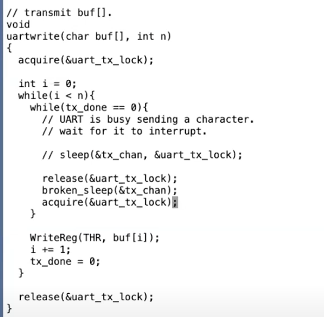

## Why threads

线程就是单个串行执行代码的单元，它只占用一个CPU并且以普通的方式一个接一个的执行指令。

除此之外，线程还具有状态，我们可以随时保存线程的状态并暂停线程的运行，并在之后通过恢复状态来恢复线程的运行。线程的状态包含了三个部分：
- PC程序计数器，表示当前线程执行指令的位置。
- 保存变量的寄存器
- 程序的Stack. 每个线程都有自己的Stack，Stack记录了函数调用的记录，反映了当前线程的执行点

xv6支持内核线程的概念，对于每个用户进程都有一个内核线程来执行来自用户进程的系统调用。所有的内核线程都共享了内核内存，所以xv6的内核线程的确会共享内存。

另一方面，xv6还有另外一种线程。每一个用户进程都有独立的内存地址空间，并且包含了一个线程，这个线程控制了用户进程代码指令的执行。所以xv6中的用户线程之间没有共享内存，你可以有多个用户进程，但是每个用户进程都是拥有一个线程的独立地址空间。xv6中的进程不会共享内存。

## 实现线程的挑战
- 第一个是如何实现线程间的切换。这里停止一个线程的运行并启动另一个线程的过程通常被称为线程调度(Scheduling)。我们将会看到XV6为每个CPU核都创建了一个线程调度器(Scheduler)。
- 第二个挑战是，当你想要实际实现从一个线程切换到另一个线程时，你需要保存并恢复线程的状态，所以需要决定线程的哪些信息是必须保存的，并且在哪保存它们。
- 最后一个挑战是如何处理运算密集型线程(compute bound thread)。对于线程切换，很多直观的实现是由线程自己自愿的保存自己的状态，再让其他的线程运行。但是如果我们有一些程序正在执行一些可能要花费数小时的长时间计算任务，这样的线程并不能自愿的出让CPU给其他的线程运行。所以这里需要能从长时间运行的运算密集型线程撤回对于CPU的控制，将其放置于一边，稍后再运行它。

处理运算密集型线程，我们可以使用定时器中断让他们配合调度，让出CPU资源，将程序运行的控制权从用户空间代码切换到内核中的中断处理程序(注，因为中断处理程序优先级更高), 哪怕这些用户空间进程并不配合工作, 内核也可以从用户空间进程获取CPU控制权。

位于内核的定时器中断处理程序，会自愿的将CPU出让(yield)给线程调度器，并告诉线程调度器说，你可以让一些其他的线程运行了。这里的出让其实也是一种线程切换，它会保存当前线程的状态，并在稍后恢复。

xv6的线程调度是这样的: **定时器中断会强制的将CPU控制权从用户进程给到内核，这里是pre-emptive scheduling(抢占式)，内核中用户进程对应的内核线程会代表用户进程出让CPU**

## 线程状态
- RUNNING，线程当前在某个CPU上运行
- RUNABLE，线程还没有在某个CPU上运行，但是一旦有空闲的CPU就可以运行
- SLEEPING，线程等待一些I/O事件

前面介绍的定时器中断或者说pre-emptive scheduling，实际上就是将一个RUNNING线程转换成一个RUNABLE线程。通过出让CPU，pre-emptive scheduling将一个正在运行的线程转换成了一个当前不在运行但随时可以再运行的线程。因为当定时器中断触发时，这个线程还在好好的运行着。

## xv6 thread scheduling
当用户程序在运行时，实际上是用户进程中的一个用户线程在运行。如果程序执行了一个系统调用或者因为响应中断走到了内核中，那么相应的用户空间状态会被保存在程序的trapframe中，同时属于这个用户程序的内核线程被激活。所以首先，用户的程序计数器，寄存器等等被保存到了trapframe中，之后CPU被切换到内核栈上运行，实际上会走到trampoline和usertrap代码中。之后内核会运行一段时间处理系统调用或者执行中断处理程序。在处理完成之后，如果需要返回到用户空间，trapframe中保存的用户进程状态会被恢复。

xv6的进程切换(线程切换)中间需要两个进程的内核线程的切换，然后在通过第二个进程的内核线程返回用户空间的第二个进程。

举个例子，CC进程切换到LS进程：
1. xv6会首先会将CC程序的内核线程的内核寄存器保存在一个context对象中
2. 类似的，因为要切换到LS程序的内核线程，那么LS程序现在的状态必然是RUNABLE，表明LS程序之前运行了一半。这同时也意味着LS程序的用户空间状态已经保存在了对应的trapframe中，更重要的是，LS程序的内核线程对应的内核寄存器也已经保存在对应的context对象中。所以接下来，XV6会恢复LS程序的内核线程的context对象，也就是恢复内核线程的寄存器
3. 之后LS会继续在它的内核线程栈上，完成它的中断处理程序(注，假设之前LS程序也是通过定时器中断触发的pre-emptive scheduling进入的内核)
4. 然后通过恢复LS程序的trapframe中的用户进程状态，返回到用户空间的LS程序中
5. 最后恢复执行LS


这里核心点在于，在XV6中，任何时候都需要经历：
1. 从一个用户进程切换到另一个用户进程，都需要从第一个用户进程接入到内核中，保存用户进程的状态并运行第一个用户进程的内核线程
2. 再从第一个用户进程的内核线程切换到第二个用户进程的内核线程
3. 之后，第二个用户进程的内核线程暂停自己，并恢复第二个用户进程的用户寄存器
4. 最后返回到第二个用户进程继续执行

```C
// sched
swtch(&p->context, &mycpu()->context);

// scheduler
swtch(&c->context, &p->context);
```
CPU结构体中的context保存了当前CPU核的调度器线程的寄存器。所以swtch函数在保存完当前内核线程的内核寄存器之后，就会恢复当前CPU核的调度器线程的寄存器，并继续执行当前CPU核的调度器线程。

`sched`的`swtch`中, `$ra`会配合`ret`完成切换，jump到`scheduler`. (`ra`指向的是swtch函数返回的地址)

不使用`$pc`的原因是：程序计数器不管怎样都会随着函数调用更新

在切换线程的时候，我们只需要保存Callee Saved Register，caller saved编译器会帮忙保存的

第二个`swtch`，会从调度器线程恢复到另一个线程`sched-swtch`的栈上。如果是没有`swtch`过的子进程

### context的位置
每一个内核线程都有一个context对象。但是内核线程实际上有两类。每一个用户进程有一个对应的内核线程，它的context对象保存在用户进程对应的proc结构体中。

每一个调度器线程，它也有自己的context对象，但是它却没有对应的进程和proc结构体，所以调度器线程的context对象保存在cpu结构体中。在内核中，有一个cpu结构体的数组，每个cpu结构体对应一个CPU核，每个结构体中都有一个context字段。

### swicthing为什么要有lock
lock字段保护了很多数据，目前来说至少保护了对于state字段的更新。举个例子，因为有锁的保护，两个CPU的调度器线程不会同时拉取同一个RUNABLE进程并运行它，虽然说它还是在running. 所以这里加锁的目的之一就是：即使我们将进程的状态改为了RUNABLE，其他的CPU核的调度器线程也不可能看到进程的状态为RUNABLE并尝试运行它。否则的话，进程就会在两个CPU核上运行了，而一个进程只有一个栈，这意味着两个CPU核在同一个栈上运行代码(注，因为XV6中一个用户进程只有一个用户线程)。

### swtch中锁的限制
上次被`swtch`进CPU的进程就是下次被换出的进程，所以`scheduler`的p是对应的.

在进程切换的最开始，进程先获取自己的锁，并且直到调用switch函数时也不释放锁。而另一个线程，也就是调度器线程会在进程的线程完全停止使用自己的栈之后，再释放进程的锁。释放锁之后，就可以由其他的CPU核再来运行进程的线程，因为这些线程现在已经不在运行了。


xv6中，不允许进程在执行switch函数的过程中，持有任何其他的锁。所以，进程在调用`swtch`函数的过程中，必须要持有`p->lock`(注，也就是进程对应的proc结构体中的锁)，但是同时又不能持有任何其他的锁。这也是包含了Sleep在内的很多设计的限制条件之一.

为了避免调度时出现中断处理程序造成思索，我们在调度获取锁之前要关中断。

假设我们在一个只有一个CPU核的机器上，进程P1调用了switch函数将CPU控制转给了调度器线程，调度器线程发现还有一个进程P2的内核线程正在等待被运行，所以调度器线程会切换到运行进程P2。假设P2也想使用磁盘，UART或者console，它会对P1持有的锁调用acquire，这是对于同一个锁的第二个acquire调用。当然这个锁现在已经被P1持有了，所以这里的acquire并不能获取锁。假设这里是spinlock，那么进程P2会在一个循环里不停的“旋转”并等待锁被释放。但是很明显进程P2的acquire不会返回，所以即使进程P2稍后愿意出让CPU，P2也没机会这么做。之所以没机会是因为P2对于锁的acquire调用在直到锁释放之前都不会返回，而唯一锁能被释放的方式就是进程P1恢复执行并在稍后release锁，但是这一步又还没有发生，因为进程P1通过调用switch函数切换到了P2，而P2又在不停的“旋转”并等待锁被释放。这是一种死锁，它会导致系统停止运行。

## Sleep & Wakeup & Lost wakeup
```C
void uartwrite(char buf[], int n) {
  acquire(&uart_tx_lock);

  int i = 0;
  while (i < n) {
    while (tx_done == 0) {
      // UART is busy sending a character
      // wait for it to interrupt
      sleep(&tx_chan, &uart_tx_lock);
    }

    WriteReg(THR, buf[i]);
    i += 1;
    tx_done = 0;
  }
  release(&uart_tx_lock);
}

void uartintr(void) {
  acquire(&uart_tx_lock);
  if (ReadReg(LSR) & LSR_TX_IDLE) {
    // ... UART finished transmitting; wake up any sending thread
    tx_done = 1;
    wakeup(&tx_chan);
  }
  release(&uart_tx_lock);

  // read and process incoming characters
  while(1) {
    // ...
  }
}

// Atomically release lock and sleep on chan.
// Reacquires lock when awakened.
void
sleep(void *chan, struct spinlock *lk)
{
  struct proc *p = myproc();
  
  // Must acquire p->lock in order to
  // change p->state and then call sched.
  // Once we hold p->lock, we can be
  // guaranteed that we won't miss any wakeup
  // (wakeup locks p->lock),
  // so it's okay to release lk.
  if(lk != &p->lock){  //DOC: sleeplock0
    acquire(&p->lock);  //DOC: sleeplock1
    release(lk);
  }

  // Go to sleep.
  p->chan = chan;
  p->state = SLEEPING;

  sched();

  // Tidy up.
  p->chan = 0;

  // Reacquire original lock.
  if(lk != &p->lock){
    release(&p->lock);
    acquire(lk);
  }
}

// Wake up all processes sleeping on chan.
// Must be called without any p->lock.
void
wakeup(void *chan)
{
  struct proc *p;

  for(p = proc; p < &proc[NPROC]; p++) {
    acquire(&p->lock);
    if(p->state == SLEEPING && p->chan == chan) {
      p->state = RUNNABLE;
    }
    release(&p->lock);
  }
}
```

### Why lock in sleep
一旦释放了锁，当前CPU的中断会被重新打开。因为这是一个多核机器，所以中断可能发生在任意一个CPU核。在上面代码标记的位置，其他CPU核上正在执行UART的中断处理程序，并且正在acquire函数中等待当前锁释放。所以一旦锁被释放了，另一个CPU核就会获取锁，并发现UART硬件完成了发送上一个字符，之后会设置tx_done为1，最后再调用wakeup函数，并传入tx_chan。目前为止一切都还好，除了一点：**现在写线程还在执行并位于release和broken_sleep之间**，也就是写线程还没有进入SLEEPING状态，所以中断处理程序中的wakeup并没有唤醒任何进程，因为还没有任何进程在tx_chan上睡眠。之后写线程会继续运行，调用broken_sleep，将进程状态设置为SLEEPING，保存sleep channel。但是中断已经发生了，wakeup也已经被调用了。所以这次的broken_sleep，没有人会唤醒它，因为wakeup已经发生过了。这就是lost wakeup问题。(简略版：在release和sleep之间，中断发生，完成写入，尝试wakeup无果)



### lost wakeup解决办法
首先我们必须要释放uart_tx_lock锁，因为中断需要获取这个锁，但是我们又不能在释放锁和进程将自己标记为SLEEPING之间留有窗口。这样中断处理程序中的wakeup才能看到SLEEPING状态的进程，并将其唤醒，进而我们才可以避免lost wakeup的问题。所以，我们应该消除这里的窗口。

为了实现这个目的，我们需要将sleep函数设计的稍微复杂点。这里的解决方法是，即使sleep函数不需要知道你在等待什么事件，它还是需要你知道你在等待什么数据，并且传入一个用来保护你在等待数据的锁。sleep函数需要特定的条件才能执行，而sleep自己又不需要知道这个条件是什么。在我们的例子中，sleep函数执行的特定条件是tx_done等于1。虽然sleep不需要知道tx_done，但是它需要知道保护这个条件的锁，也就是这里的uart_tx_lock。在调用sleep的时候，锁还被当前线程持有，之后这个锁被传递给了sleep。

在接口层面，sleep承诺可以原子性的将进程设置成SLEEPING状态，同时释放锁。这样wakeup就不可能看到这样的场景：**锁被释放了但是进程还没有进入到SLEEPING状态**。所以sleep这里将释放锁和设置进程为SLEEPING状态这两个行为合并为一个原子操作。

所以我们需要有一个锁来保护sleep的条件，并且这个锁需要传递给sleep作为参数。更进一步的是，当调用wakeup时，锁必须被持有。如果程序员想要写出正确的代码，都必须遵守这些规则来使用sleep和wakeup。+

总结一下就是：
- 调用sleep时需要持有condition lock，这样sleep函数才能知道相应的锁。
- sleep函数只有在获取到进程的锁p->lock之后，才能释放condition lock。
- wakeup需要同时持有两个锁才能查看进程。

有点像crab latching的。

## System call: exit() & wait()
在xv6中，一个进程如果退出的话，我们需要释放用户内存，释放pagetable，释放`trapframe`对象，将进程在进程表单中标为`REUSABLE`，这些都是典型的清理步骤。当进程退出或者被杀掉时，有许多东西都需要被释放。

这里会产生的两大问题：
- 首先我们不能直接单方面的摧毁另一个线程，因为：另一个线程可能正在另一个CPU核上运行，并使用着自己的栈；也可能另一个线程正在内核中持有了锁；也可能另一个线程正在更新一个复杂的内核数据，如果我们直接就把线程杀掉了，我们可能在线程完成更新复杂的内核数据过程中就把线程杀掉了。我们不能让这里的任何一件事情发生。
- 另一个问题是，即使一个线程调用了exit系统调用，并且是自己决定要退出。它仍然持有了运行代码所需要的一些资源，例如它的栈，以及它在进程表单中的位置。当它还在执行代码，它就不能释放正在使用的资源。所以我们需要一种方法让线程能释放最后几个对于运行代码来说关键的资源。

从exit接口的整体来看，在最后它会释放进程的内存和pagetable，关闭已经打开的文件，同时我们也知道父进程会从wait系统调用中唤醒，所以exit最终会导致父进程被唤醒。这些都是我们预期可以从exit代码中看到的内容。

如果一个进程要退出，但是它又有自己的子进程，接下来需要设置这些子进程的父进程为init进程。我们接下来会看到，每一个正在exit的进程，都有一个父进程中的对应的wait系统调用。父进程中的wait系统调用会完成进程退出最后的几个步骤。所以如果父进程退出了，那么子进程就不再有父进程，当它们要退出时就没有对应的父进程的wait。所以在exit函数中，会为即将exit进程的子进程重新指定父进程为init进程，也就是PID为1的进程。

```C
  // we need the parent's lock in order to wake it up from wait().
  // the parent-then-child rule says we have to lock it first.
  acquire(&original_parent->lock);

  acquire(&p->lock);

  // Give any children to init.
  reparent(p);

  // Parent might be sleeping in wait().
  wakeup1(original_parent);

  p->xstate = status;
  p->state = ZOMBIE;

  release(&original_parent->lock);

  // Jump into the scheduler, never to return.
  sched();
  panic("zombie exit");
```

接下来，进程的状态被设置为ZOMBIE。现在进程还没有完全释放它的资源，所以它还不能被重用。所谓的进程重用是指，我们期望在最后，进程的所有状态都可以被一些其他无关的fork系统调用复用，但是目前我们还没有到那一步。
现在我们还没有结束，因为我们还没有释放进程资源。我们在还没有完全释放所有资源的时候，通过调用sched函数进入到调度器线程。

到目前位置，进程的状态是ZOMBIE，并且进程不会再运行，因为调度器只会运行RUNNABLE进程。同时进程资源也并没有完全释放，如果释放了进程的状态应该是UNUSED。但是可以肯定的是进程不会再运行了，因为它的状态是ZOMBIE。所以调度器线程会决定运行其他的进程。

总之进程不能自己杀自己，要在父进程的`wait`中`freeproc`掉

## System call: kill()
```C
// Kill the process with the given pid.
// The victim won't exit until it tries to return
// to user space (see usertrap() in trap.c).
int
kill(int pid)
{
  struct proc *p;

  for(p = proc; p < &proc[NPROC]; p++){
    acquire(&p->lock);
    if(p->pid == pid){
      p->killed = 1;
      if(p->state == SLEEPING){
        // Wake process from sleep().
        p->state = RUNNABLE;
      }
      release(&p->lock);
      return 0;
    }
    release(&p->lock);
  }
  return -1;
}
```
Unix中的一个进程可以将另一个进程的ID传递给kill系统调用，并让另一个进程停止运行。如果我们不够小心的话，kill一个还在内核执行代码的进程，会有一些我几分钟前介绍过的风险，比如我们想要杀掉的进程的内核线程还在更新一些数据，比如说更新文件系统，创建一个文件。如果这样的话，我们不能就这样杀掉进程，因为这样会使得一些需要多步完成的操作只执行了一部分。所以kill系统调用不能就直接停止目标进程的运行。实际上，在XV6和其他的Unix系统中，kill系统调用基本上不做任何事情。

它先扫描进程表单，找到目标进程。然后只是将进程的proc结构体中killed标志位设置为1。如果进程正在SLEEPING状态，将其设置为RUNNABLE。这里只是将killed标志位设置为1，并没有停止进程的运行。所以kill系统调用本身还是很温和的。

而目标进程运行到内核代码中能安全停止运行的位置时，会检查自己的killed标志位，如果设置为1，目标进程会自愿的执行exit系统调用。你可以在trap.c中看到所有可以安全停止运行的位置. `usertrap`会检查进程是否被设置为`killed`.

所以kill系统调用并不是真正的立即停止进程的运行，它更像是这样：**如果进程在用户空间，那么下一次它执行系统调用它就会退出，又或者目标进程正在执行用户代码，当时下一次定时器中断或者其他中断触发了，进程才会退出。所以从一个进程调用kill，到另一个进程真正退出，中间可能有很明显的延时。**

如果一个sleeping进程被killed了，还得要把他设置为RUNNABLE, 这意味着，即使进程之前调用了sleep并进入到SLEEPING状态，调度器现在会重新运行进程，并且进程会从sleep中返回。所以对于SLEEPING状态的进程，如果它被kill了，它会被直接唤醒，包装了sleep的循环会检查进程的killed标志位，最后再调用exit。

同时还有一些情况，如果进程在SLEEPING状态中被kill了并不能直接退出。例如，一个进程正在更新一个文件系统并创建一个文件的过程中，进程不适宜在这个时间点退出，因为我们想要完成文件系统的操作，之后进程才能退出。我会向你展示一个磁盘驱动中的sleep循环，这个循环中就没有检查进程的killed标志位。

## LAB

### Uthread: switching between threads
就是实现用户级线程的切换，本质和xv6的线程切换差不多。在线程创建阶段的时候要将`ra`,`sp`设置好
```C
void 
thread_create(void (*func)())
{
  struct thread *t;

  for (t = all_thread; t < all_thread + MAX_THREAD; t++) {
    if (t->state == FREE) break;
  }
  t->state = RUNNABLE;
  // YOUR CODE HERE
  // set register ra and sp, sp should start from thread.stack[8192] (from top to bottom)
  *((uint64 *)(t->stack)) = (uint64)func;
  *((uint64 *)(t->stack) + 1) = (uint64)(t->stack + 8192);

  //printf("%p, %p\n", t->stack)
}

// schedule
thread_switch((uint64)&t->stack, (uint64)&next_thread->stack);
```
这里整了个活，用stack的低地址空间保存了callee saved register，包括`ra`和`sp`，因为栈从高向下生长，如果没有覆盖掉这几个保存的寄存器，那么切换肯定也是正常的哈哈。只用三行代码就能把这个lab hack掉了。

正常写法是，为每个thread配备一个context保存该保存的寄存器，像这样：
```C
// Saved registers for user-level thread switching
struct thread_context {
  uint64 ra;
  uint64 sp;

  // callee-saved
  uint64 s0;
  uint64 s1;
  uint64 s2;
  uint64 s3;
  uint64 s4;
  uint64 s5;
  uint64 s6;
  uint64 s7;
  uint64 s8;
  uint64 s9;
  uint64 s10;
  uint64 s11;
};

struct thread {
  struct thread_context     thread_context;    /* register status */
  char                      stack[STACK_SIZE]; /* the thread's stack */
  int                       state;             /* FREE, RUNNING, RUNNABLE */
};
```
再对context初始化和用context完成切换过程中的reg ld & sd.

### Using threads
没啥好说的，直接为每个bucket配备一把锁就可以了。

### Barrier
barrier的作用是，当所有线程都"撞到"这个点后，代码才可以继续进行下去。维护个计数，用好锁和条件变量就可以辣：
```C
static void 
barrier()
{
  // YOUR CODE HERE
  //
  // Block until all threads have called barrier() and
  // then increment bstate.round.
  //
  pthread_mutex_lock(&bstate.barrier_mutex);
  bstate.nthread++;
  if(bstate.nthread != nthread){
    pthread_cond_wait(&bstate.barrier_cond, &bstate.barrier_mutex);
    pthread_mutex_unlock(&bstate.barrier_mutex);
  } else {
    bstate.round++;
    // printf("inc 1\n");
    bstate.nthread = 0;
    pthread_mutex_unlock(&bstate.barrier_mutex);
    pthread_cond_broadcast(&bstate.barrier_cond);
  }
}
```